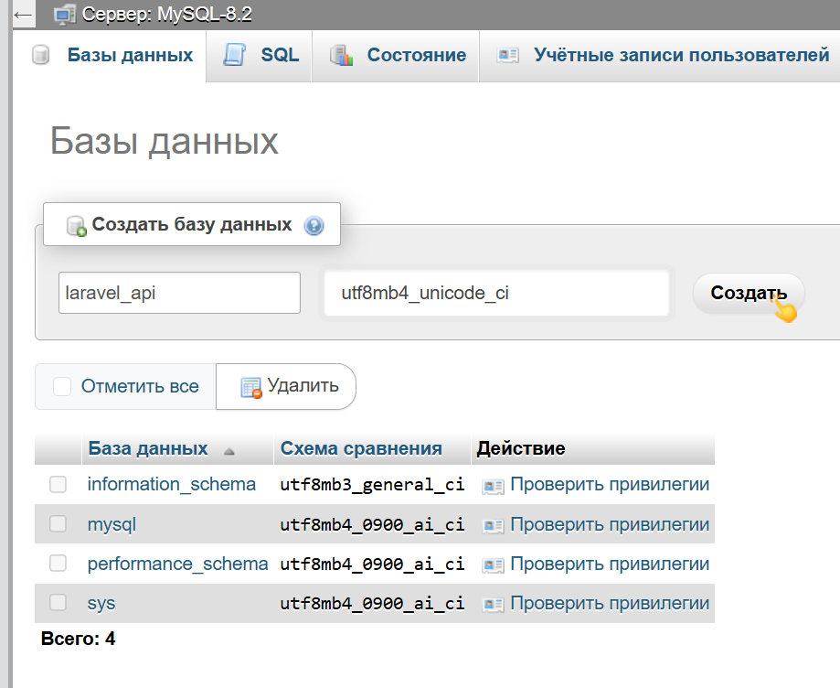
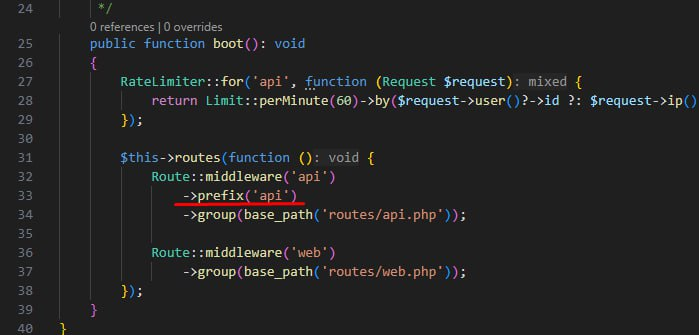

(1) Меняем БД в настройках проекта

1.1. Меняем .env файл

```env
APP_URL=http://lv-auth.local
```

```env
DB_CONNECTION=mysql
DB_HOST="MySQL-8.2"
DB_PORT=3306
DB_DATABASE=laravel_api <- название таблицы
из БД (PhpMyAdmin) кодировка: utf8mb4_unicode_ci

DB_USERNAME=root
rootDB_PASSWORD=
```

1.2. Создаем БД в PhpmyAdmin



1.3. Выполняем миграции

```cmd
php artisan migrate
```

(2) Создаем модель для пользователя

P.S. модели хранятся по пути: app/Models

```cmd
php artisan make:model User -m
```

(3) Создание контролера

P.S. контроллеры находятся по пути: app/Http/Controllers

```cmd
php artisan make:controller Api\V1\nameControler —-model=User --requests --api
```

P.S.
1. —model=User (ссылаемся на уже готовый файл модели который лежит по пути: app/Models)
2. —requests (валидационные правила)
3. —api (убирает лишние модули)

(4) Настройка роутинга

P.S. все роуты находятся по пути: routes/

```php
Route::post('/registration', [UserController::class, 'register']);

// Если вошел в аккаунт разрешается:
Route::group(['middleware' => 'auth:sanctum'], function () {
	Route::get('/logout', [UserController::class, 'logout']);
});
```

(5) Добавление ресурсов

P.S. ресурсы находятся по пути: \app\Http\Resources

```cmd
php artisan make:resource NameResource
```

(6) Редактирование роутов по умолчанию

В app/providers/RouteServiceProvider нужно убрать ->prefix('api')

