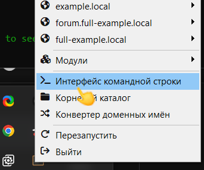
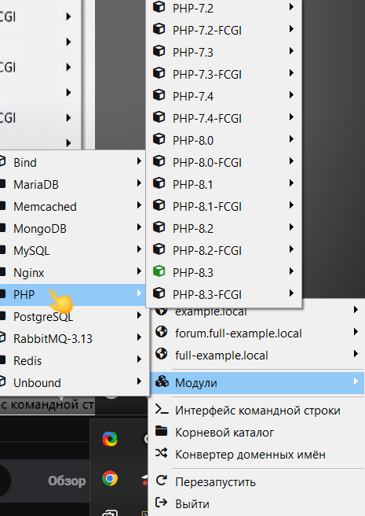
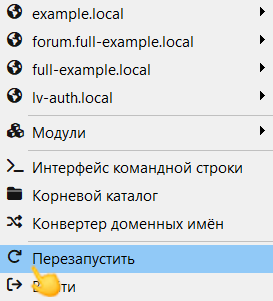
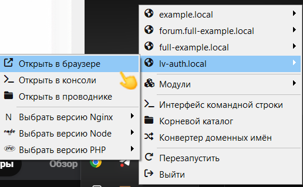
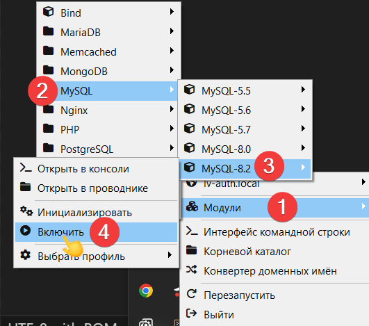

(1) Заходишь в папку OSPanel/home (где скачан openserver), создаешь папку (на конце .local) после чего пкм по open server panel, затем интерфейс командной строки



(2) В cmd OSP пишем

```powershell
cd home/project-name.local
composer create-project "laravel/laravel:^10.0" .
```

(3) Включаем в OSP нужную версию PHP



(4) Из любого другого проекта в OSPanel/home берем папку .osp только с файлом project.ini

```ini
[lv-auth.local] <- название проекта

php_engine = PHP-8.3 <- версия php (из 3 пункта)
public_dir = {base_dir}\public
```

(5) Перезапускаем сервер


 
(6) Проект появился можно производить с ним взаимодействия (например для проверки открыть его в браузере)



(7) Включаем нужную версию MySQL



(8) Подключение PhpmyAdmin 

8.1. [https://www.phpmyadmin.net/] <- переходишь сюда и скачиваешь
8.2. Создаем в OSPanel/home папку php.local в нее как в 4 пункте закидываем папку .osp

```ini
[php.local] <- название проекта

php_engine = PHP-8.3 <- версия php (из 3 пункта)
public_dir = {base_dir}\public
```

8.3. Создаем в /home/php/ папку public и закидываем в нее все что скачали с 8.1. пункта
8.4. находим файл config.sample.inc.php меняем его на config.inc.php
8.5. Заходим в файл config.inc.php и меняем там следующее

```php
$cfg['blowfish_secret'] = '7040DF61B592E6F8CEBE4CAE84F9D7FD';

$cfg['Servers'][$i]['host'] = 'MySQL-8.2';

$cfg['Servers'][$i]['AllowNoPassword'] = true; <- вкл/выкл пароля
```

8.6. Перезагружаем сервер